\newpage{}

# Introduction

Heart Rate Variability (HRV) is a way to measure the variation in time between each heartbeat (@hrvstanford). This variation is a measure of how the heart reacts to physical exercise, mental stress and heart diseases (@1907.07496), directly linked to an increased risk of mortality (@UMETANI1998593). 

It has its origin on neurons from the parasympathetic, sympathetic nervous system and vagus nerve. Evidence suggests that HRV is impacted by stress (@Kim2018), specifically due to higher levels of stress resulting in a lower HRV (@hrv4training).

While stress (and its causes and effects) is a known research topic, it's also more accessible due to the widespread usage of wearables that allow the collection of HRV data. The combination of the possibility of stress analysis from HRV and easy access to data, makes this the main focus of the present report, determining whether machine learning techniques can help minimalizing generalization errors.

This report is structured into three main parts: data analysis, supervised and unsupervised learning. All three parts revolve around predicting and/or clustering HRV values.

\pagebreak

# Part I

## Description of the data set

### Origin and introduction to the data sets

The data set is comprised of several different data sets, obtained from the Apple Watches of the author, for around 2 years. In this period, both the Apple Watch 3 and 4 were used and when referring to Apple Watch in this report, it pertains to both models - unless stated otherwise.

<!---
# TODO: Add addendum to describe apple watch 3 and 4
-->

The data sets are:

- Activity Energy Burned: energy in kcal burned throughout different periods of the day.
- Apple Exercise Time: number of minutes within a given interval of time where exercise was tracked. Apple considers exercise as (@applewatch):

> "_[...] every full minute of movement that equals or exceeds the intensity of a brisk walk._"

- Apple Stand Hours: number of times per hour that the subject has stood up.
- Flights Climbed: number of flights climbed within a given interval of time, measured several times during the day.
- Heart Rate: number of beats per minute measured every 5 seconds. The Apple Watch uses a technology called photoplethysmography,  where (@applewatch2)

> "_[...]green LED lights paired with light‑sensitive photodiodes to detect the amount of blood flowing._"

- Mindful Session: time span (in intervals of seconds) where a meditation session was tracked.
- Heart Rate Variability (hereafter referred to as HRV): the Apple Watch computes the standard deviation of all normal sinus RR intervals over 24h (or SDNN). An RR interval is a beat-to-beat difference. When HRV is mentioned in this report, it refers to the SDNN values.
- Activity Summary: daily summary of some of the above-mentioned features.


The data was exported using the iPhone's export functionality inside the Health application. It originally comes in a XML format and there is a number of tools available for conversion from XML to CSV format, one of which was used to do the conversion to CSV.

### Previous work with the data

Considering the lifetime of the Apple Watch, and assuming that the Heart Rate and HRV are to be included, the research is scarce and dispersed. There is research using data from Apple Watch, but falls into one of two categories: improving existing measurements (@1910.07881) or detection of various problems (as described in the introduction), some of which using Machine Learning and with success. In the latter category, it was possible to verify that Machine Learning was used successfully to classify sleep-wake patterns (@1908.06856) and also detecting cardiovascular problems (@1802.02511).

However, the above mentioned cased are generic in the sense that only variations of the data set were used and for different subjects of study. In this project, the data set pertains to one single user, with observations made over the course of 2 years.

Considering the target of the data is the author, nothing (besides the export) has been done to the data. The merge of the different data sets will happen as a part of the data preparation of this report.

### Primary machine learning modeling aim

<!--
Some data comes from the iPhone and this doesn't mention it.
-->

This particular data set revolves around metrics of several different attributes. The principal challenge was to select the main attribute that was both relevant in terms of health impact, while leveraging the heart rate monitoring features that the Apple Watch provides, but also with enough observations so that it can be correlated with the remainder of different attributes monitored.

As mentioned in the introduction, HRV is an indicator of one's health status quo. Specifically, a lower HRV indicates both stress and cardiovascular potential problems, according to existing research. Considering other attributes monitored by the Apple Watch, such as the steps count and/or mindful session, it provides an interesting starting point to answer how is HRV affected by certain attributes. 

Moreover, the data set with the HRV can be broken down into new interesting attributes. For instance, where is HRV higher or lower? Is it during work or after work hours? Is it during the week or at the weekends? In which season of the year? Specifically, it can potentially be used for several different machine learning tasks, such as:

- Classification: how likely an HRV value belongs to a class of working hours or after-work hours. The original data doesn't have these features, thus its need to extract information from the data set. Specifically, this means that the existing HRV values (that are measured in various intervals of time), need to be split and grouped into two intervals of time (in a binary format): the first referring to an interval of time between 9 am and 5 pm (commonly referred as "working hours") and the period of non-working hours from 5 pm to 9 am. Data collected during the sleeping time will be included because lower HRV (reflected as stress) can occur during the night. Nonetheless, most of the measurements were made during wake time considering it was very rare that the Apple Watch was used during sleep time.

- Regression: so that it's possible to determine what's the estimated HRV value for the next day, based on the data from the previous days. The observations are made in periods more granular than a full day, but for this regression, the average values of HRV will be used. There are two main reasons for this "grouping": the intervals where the observations happen are not regular and don't have the same time span. For example, there could be several measurements in the morning in one day during a period of 5minutes and in another day the period could be shorter with just a few measurements made.

- Clustering: based on HRV measurements, determine if there was more or less physical activity (namely, whether the steps count and/or the flights climbed). Another possibility is to determine any clusters regarding the time (whether being day of the week and/or hour of the day) where these measurements occurred.

- Association mining: give certain features (such as step count and/or the number of meditation sessions) which are more likely to influence HRV values. Another possibility is to determine whether an HRV observation (in regards to date and time) has any probability of being measured on another date and time. An example is if there is any relation between a measurement of an HRV value in the morning with the day of the week.

Despite being a rich data set (i.e. a reasonable number of observations made over a period of 2 years, with many attributes spread over different data sets), it entails some limitations and issues. For one, there is not a single data set but rather a few different ones. It's a non-simple data set due to being a time series one. Specifically, there is one data set for the Activity Summary, one for Step Count, one for HRV, one for mindful sessions and one for flights climbed. All these data sets have different time spans and measure times thus these have had to be standardized so they can be compared - i.e., they have different intervals. These data sets were standardized through the average values per day. Nonetheless, the HRV data set could be used as a standalone non-standardized data set and some features could be created out of it.

There is also the issue regarding the time span of observations, meaning that some observations were made several times during the day whereas others were not. Apple provides a summary of some of the attributes presenting observation values within a period of a day, but it's not for all attributes - namely "Active Energy Burned", "Apple Exercise Time" and "Apple Stand Hours" thus excluding HRV, flights climbed and step count.

Another issue is the definition of "Apple Exercise Time". As mentioned before, Apple describes it as anything more intense than a "brisk walk" without really defining what a brisk walk is. It's also not possible to determine which of the step count attribute counted as exercise time. The same for the flights climbed feature.

\pagebreak

## Data attributes analysis

The data attributes analysis will be split into two main data sets: the first is a standardized data set comprised of the average daily values for Active Energy Burned (AEB), Exercise Time (ET), Stand Up (SU), HRV, Step Count (SC), Flights Climbed (FC) and Meditation Time (MT); the second data set is the raw data set of the HRV, although with two added features. Each feature of each of the data sets is explained below.

There's one attribute that is transversal to both data sets: the HRV. This attribute is a continuous ratio, assuming that an HRV of 0 is an absence of measurement. A zero value refers to a really low HRV, thus indicating a level of healthiness that is non-existent (in terms of the standard deviation of NN intervals, SDNN). It's measured in milliseconds (ms).

The index of both data sets is a timestamp, commonly referred to as _creationDate_ (or just _timestamp_ in other cases). In the first data set, this refers to the measurements on all of the features. Because some features were not measured at the same time, some of the values had to be dropped. This is will be scrutinized later on in this work. In the second data set, this refers to when the measurements of HRV were made.

The following subchapters analyze each attribute of each data set.


### Data set I

<!--
    TODO: am I using present or past? It's not the same
-->

To reach to the final state of the data set I, where all the features are gathered, a few data sanitization tasks were necessary. The Activity Summary - the default exported file from the Apple Watch and iPhone - had three features: AEB, ET and SH. The format of these features were already discriminated in a a daily time interval. In other words, all measurements' values were made within a day. Let's analyse them individually:

- AEB. The unit of measure is kcal per day. It's a continuous attribute because it can take any values between the ones being measured. It has a ratio attribute type, considering there is a natural zero.

- ET. The unit of measure is in minutes per day. It's continuous and ratio.

- SU. The unit of measure is in times per day, where "time" corresponds to an integer determining how many the subject has stood up, within a total time frame of a day. It's discrete and ratio.

Following these attributes, another two sets were sanitized and merged with the above explained data. This is specifically referring to the SC, FC and MT attributes. The SC had its observations made throughout any given period of the day. In other words, whenever any step count happened, it was registered. These values are collected with the iPhone and not the Watch. To be merged with the above attributes they had to be "compressed" into the same period (observations with a day). To achieve this, the values of the raw data set that contained the SC were normalized by doing the sum of values per day.

A similar approach was made with the FC attribute. The raw data was normalized by doing the sum of the values of the observations per day. After these two steps (merging and normalization), the values were then merged with the remainder of the attributes of data set I. Thus, also analyzing these attributes individually:

- SC. The unit of measure is the total steps made within a day's interval. It's a discrete and ratio attribute type.

- FC. The unit of measure is the total number of flights climbed per day. It's a discrete and ratio attribute type.

- MT. The unit of measure is seconds meditated per day. It's continuous and ratio.

There are a few different issues with the data. On an initial observation, it's possible to conclude that, after the data was exported from the iPhone and Apple Watch, it had to be normalized to total values observed per day. Considering that the Activity Summary had a total number of observations (N) of 556 compared to the original N for the SC which was 38408, it's possible to understand the dimension of the reduction that happened when converting SC to units measure per day.

Another issue was regarding missing data. Not all of the features had all the observations and the missing data for these features was not occurring within the same period than other features that also had missing data, thus reducing the total number of observations. None of the missing observations was converted to zero, meaning that the averages and other calculations for the same data set, had different N sizes.

Moreover, a few attributes at to be type-coerced, meaning that some values were strings and had to be converted to integer and floating numbers.

### Data set II 

The second data set includes an original feature (i.e., a feature that come from the original iPhone/Watch data sets) and other features that were created based on the original feature. The original feature is the HRV measurements.

Because the frequency of the measurements was irregular, a resampling of the data was necessary. Thus, an upsampling of the timestamps (specifically, the hours) was made, using mean values for the interpolation, using the following methods from the _DataFrame_ handled by _pandas_:

```
.resample('H').mean().interpolate()
```

The remaining features created were made to determine what is influenced by or influences HRV values. For this goal, the created attributes were: 

 - Is At Work (IAW). The unit of measure is binary. The value 1 is set if the time of the day is between 9am (including) and 5pm
(excluding) and 0 if the HRV observation was made during the remaining period of the day and saturdays and sundays. It's a discrete/binary attribute with a nominal type.
- Is Above Mean Value (IAMV). The unit of measure is binary. The value 1 is set if the HRV value is above the calculated mean (which is 41.249) and a value of 0 if it's below the mean of HRV. It's a discrete/binary attribute with a nominal type. 
- Hour of Day (HOD). The unit of measure is the hour of the day (between 0 and 23). It's a discrete attribute with an interval attribute type. 
- Day of Week (DOW). The unit of measure is the day of week (between 1 and 7, where 1 represents a monday and 7 represents a sunday). It's a discrete attribute with an interval attribute type.
- Is Morning (IM). The unit of measure is binary. The value 1 is set if the date of the measurement is between 6am (included) and 12am (excluded). It's a discrete/binary attribute with a nominal type. 
- t+1. This is a lagged feature based on the HRV value, as explained before. It refers to the values of the next hour. These feature was created to make regression possible. The unit of measure and the attribute types is the same as the HRV original values. It was made possible using the _shift_ attribute from _pandas_ library: `.shift(periods=1)`


<!-- TODO: Missing new features (check jupyter notebook for dataset II) -->


## Summary statistics of the attributes

### Data set I

Here's a preview of the values of data set I:

| Date       |   SC (count) |   FC (count) |   MT (seconds) |   AEB (kcal) |   ET (seconds) |   SU (count) |   HRV (ms) |
|:-----------|-------------:|-------------:|---------------:|-------------:|---------------:|-------------:|-----------:|
| 2018-01-16 |        10752 |            9 |            689 |      356.837 |           1200 |           13 |    36.5773 |
| 2018-01-20 |        14288 |            9 |           1382 |      337.801 |           1320 |           13 |    37.7527 |
| 2018-01-22 |         9850 |           11 |           1792 |      259.989 |            600 |           10 |    28.6433 |
| 2018-01-23 |         6884 |            4 |            705 |      337.471 |            720 |           16 |    27.9964 |
| 2018-01-27 |        34061 |           13 |           1398 |      666.704 |           5700 |            8 |    36.5746 |


Table:  First five observations (data set I)


|       |   SC (count) |   FC (count) |   MT (seconds) |   AEB (kcal) |   ET (seconds) |   SU (count) |   HRV (ms) |
|:------|-------------:|-------------:|---------------:|-------------:|---------------:|-------------:|-----------:|
| count |       111    |     111      |        111     |      111     |        111     |    111       |   111      |
| mean  |     11679.5  |      13.8829 |       1009.07  |      368.491 |       1093.51  |     11.1171  |    42.8225 |
| std   |      7862.59 |      10.3667 |        532.345 |      157.171 |        919.771 |      3.78931 |    12.3163 |
| min   |       266    |       2      |         60     |        2.684 |          0     |      1       |    21.9545 |
| 25%   |      6682.5  |       6.5    |        690     |      274.454 |        450     |      9       |    35.0982 |
| 50%   |      9850    |      12      |        811     |      356.837 |        900     |     12       |    41.7738 |
| 75%   |     14222    |      17.5    |       1351.5   |      451.418 |       1440     |     14       |    49.2031 |
| max   |     43598    |      73      |       3675     |      863.354 |       5700     |     19       |   104.893  |


Table:  Summary for daily statistics (data set I)


### Data set II

|    | timestamp           |     HRV |   IAW |   HOD |   DOW |   IM |      t+1 |
|---:|:--------------------|--------:|------:|------:|------:|-----:|---------:|
|  0 | 2018-01-16 09:00:00 | 38.7547 |     1 |     9 |     2 |    1 | nan      |
|  1 | 2018-01-16 10:00:00 | 36.4794 |     1 |    10 |     2 |    1 |  38.7547 |
|  2 | 2018-01-16 11:00:00 | 34.2041 |     1 |    11 |     2 |    1 |  36.4794 |
|  3 | 2018-01-16 12:00:00 | 31.9287 |     1 |    12 |     2 |    0 |  34.2041 |
|  4 | 2018-01-16 13:00:00 | 29.6534 |     1 |    13 |     2 |    0 |  31.9287 |

Table: First five observations (data set II)


|       |         HRV |          IAW |         HOD |         DOW |           IM |         t+1 |
|:------|------------:|-------------:|------------:|------------:|-------------:|------------:|
| count | 15069       | 15069        | 15069       | 15069       | 15069        | 15068       |
| mean  |    41.2037  |     0.23837  |    11.4992  |     4.00239 |     0.250116 |    41.2063  |
| std   |    11.9823  |     0.426101 |     6.92304 |     1.99658 |     0.433094 |    12.0014  |
| min   |     8.21203 |     0        |     0       |     1       |     0        |     8.21203 |
| 25%   |    33.5111  |     0        |     5       |     2       |     0        |    33.5131  |
| 50%   |    39.6968  |     0        |    11       |     4       |     0        |    39.6977  |
| 75%   |    47.6074  |     0        |    18       |     6       |     1        |    47.6076  |
| max   |   144.31    |     1        |    23       |     7       |     1        |   173.526   |


Table:  Summary statistics for Heart Rate Variability (data set II) with lagging (t+1)

\pagebreak

## Data visualization

## Data set I

### Detection of outliers

The detection of outliers is, for now, made through a visual analysis of the occurrences of all of the attributes. To visualize them in just one chart, the data was standardized (using _StandardScaler_ from _Scikit-Learn_). 
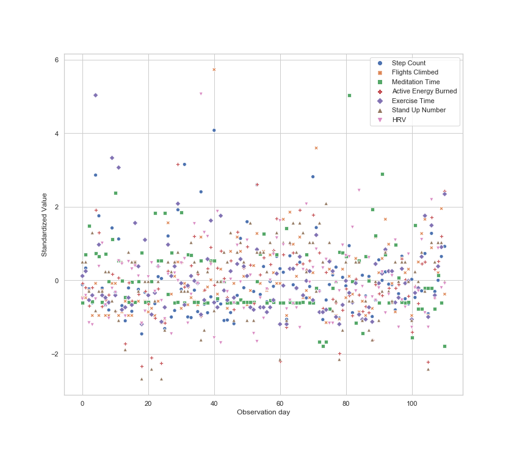{ width=100% height=100% }

These standardized values are also excluding any non-existent values, meaning that if any of the attributes had a non-existent value, then all the attributes of that observation were also removed. This significantely reduced the number of observations to 111.

It's possible to see a few potential outlier candidates with standardized values above 4. Nonetheless, the difference between these values seem to not be too significant enough to determine them as outliers. Using visual inference to determine outliers seems to be insufficient.

### Distribution

The non-standardized histogram of the attributes is represented as: 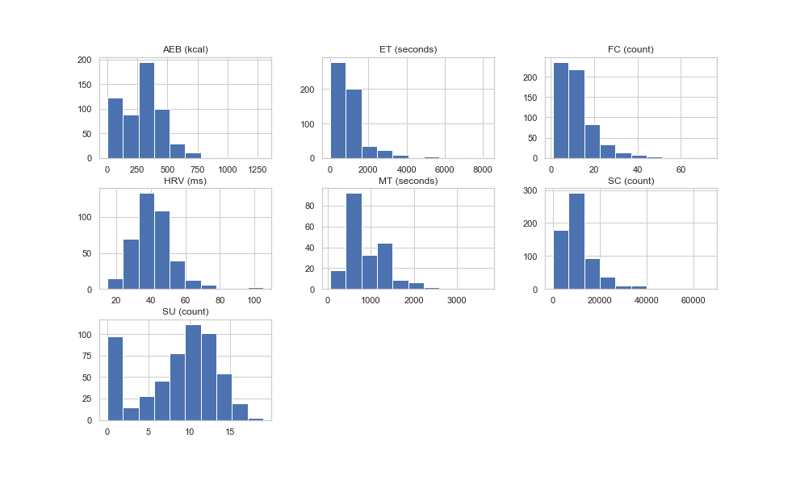{ width=100% height=100% }

The attributes don't seem to be symmetrically distributed, except for HRV which follows a bell-shaped curve (although not a perfect one). An outlier can be the explanation for the asymmetrical shape of the HRV curve. Stand Up (SU) and Step Count (SC) also seem to have outliers and an initial assumption can be that removing those outliers would turn its histograms into normally distributed curves.

\pagebreak

### Variable correlation

The correlation of the different attributes is represented as: 

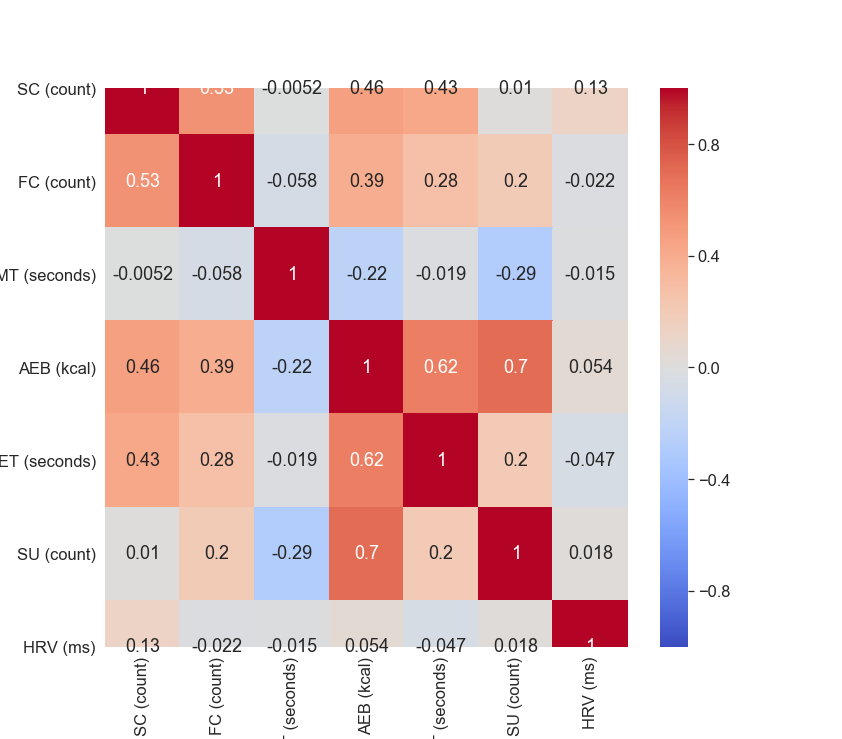{ width=100% }

It's possible to see that there are two significant correlations. One between Active Energy Burned and Exercise Time (0.62), which intuitively makes sense. And another correlation between Stand up Number and Active Energy Number (0.7). However, there seems to be a lack of correlation between any of the attributes and the HRV, thus challenging the initial premise of this project - whether the HRV is affected by other attributes.

Even though research has proven that there is a correlation between HRV and exercise time or meditation time, in this case, there seems to be no correlation. A possible explanation is due to the low amount of observations (both for the standardized and non-standardized data, $N=111$).

\pagebreak

### Principal Components Analysis (PCA)

Being PCA a form of dimensionality reduction, it only makes sense to apply it on data sets with a relevant number of features (in this case 7 features), so that it's possible to analyze and reduce the existing dimensions. For this reason, data set I was selected for this analysis.

#### Explained variance


To obtain the explained variance, a PCA was performed on the entire data set I. The data set was previously scaled and the _PCA_ method from the _decomposition_ method belonging to _scikit-learn_ was then used.

```
from sklearn.decomposition import PCA

pca = PCA(n_components=7)
principal_components = pca.fit_transform(df_standardized)
```

It was now possible to obtain the _explained variance ratio_ from each of the components. The following figure represents the _cumulative explained variance_:

 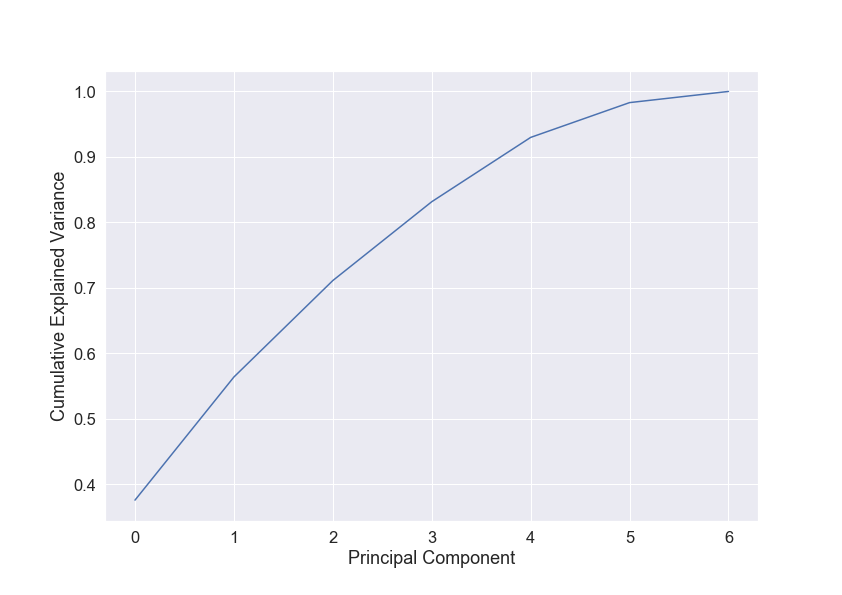{ width=100% }

It's important to set an assumption before analyzing the results: to not lose much information from the original data set, an accumulated explained variance of above 90% is needed. 

Now analyzing the results, it's possible to verify that to keep an accumulated explained variance above the 90% threshold, there's not much room for dimensionality reduction since there will be the need to project the data onto (at least) 5 Principal Components. This makes the visualization of the data projected impossible, considering it's a 5-dimensional one.

However, to visualize it, a significant amount of information will be lost. Specifically, to have PC0, PC1 and PC2 visualized (which account for 71% of the cumulative explained variance), 29% of the information of the data would be lost. Moreover, in order to project the data set I onto just PC0 and PC1, 44% of the information will be lost. 

<!-- Thus there is not much room for dimensionality reduction. Nevertheless, it's possible to project the data until PC4 meaning that two dimensions can be reduced from the original data set. -->

\pagebreak

### Principal directions of the PCA components

For two components, the principal components directions are displayed in the following table:

|    |   Principal Component 0 |   Principal Component 1 |
|---:|------------------------:|------------------------:|
|  0 |                0.406943 |                0.481579 |
|  1 |                0.395987 |                0.30238  |
|  2 |               -0.163709 |                0.552063 |
|  3 |                0.562574 |               -0.171484 |
|  4 |                0.438216 |                0.184075 |
|  5 |                0.377186 |               -0.555503 |

Table: Principal Components Directions

It's possible to conclude, based on the table above, that relatively high values of Step Count, Flights Climbed, Active Energy Burned, Exercise Time, Stand up number will result in positive projections of the first principal component (PC0). A relatively low value of Meditation will result in a negative projection of the same PC.

For PC1, relatively high values of Step Count, Flights Climbed, Meditation and Exercise Time will result in positive projections onto this secondary component. Negative values of Stand up Number and Active Energy will result in low projections onto PC1.

#### Projected data onto the Principal Components


Considering the target is the HRV feature, figure \ref{data_projection_fig} demonstrates the projection of the target onto PC0 and PC1.

{ width=100% }

It's possible to verify that, in a two-dimensional representation, a significant amount of information for the original target has been lost, since there are higher values than the ones represented that have been omitted. 

\pagebreak

## Data set II

<!-- TODO: Specifiy nr of attributes and observations -->

Data set II is significantly different than I, due to its inferior amount of attributes and the number of observations. For this reason and also because a PCA was already performed beforehand, a PCA analysis wasn't performed. Moreover, the purpose of understanding Principal Components Analysis was achieved with data set I. 

Nonetheless, the detection of outliers was made.

### Detection of outliers

The detection of outliers was made on an interpolated (i.e., lagged version of data set II).

<!-- TODO: REMOVE OUTLIER BECAUSE IT WILL BE A BEAUTIFUL NORMAL DISTRIBUTION -->
There's a potential outlier when looking at the values of HRV over time.
{ width=100% height=100% }

### Distribution

Figure \ref{ds2_hist} shows the histogram of the attributes. It seems that _HRV_ and _t+1_ follow a normal distribution. 

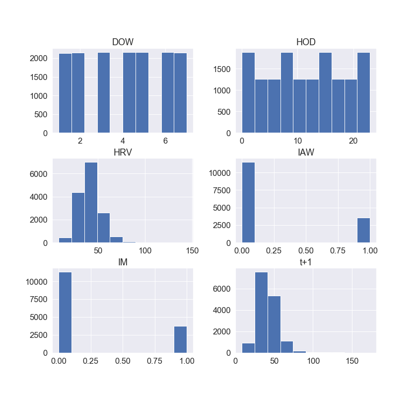{ width=100% height=100% }


### Variable correlation

The heatmap on figure \ref{ds2_corr} shows the linear correlation between attributes of data set II. It's possible to see that the _t+1_ variable has a very high positive correlation (0,97). This, as well as the number of observations ($N=15069$), seem to be good indicators to use this data set for the upcoming regression exercises. 

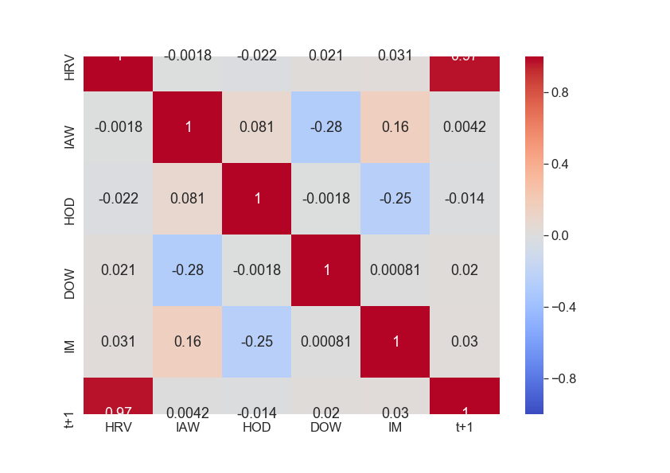{ width=100% }

\pagebreak

## Conclusion of Part I

The conclusion for Part I of this report can be subdivided into different categories. 

### Difference in data sets

To perform the needed tasks on this report, there had to be some data manipulation on the original dataset. This data manipulation was made so that _HRV_ was still a central piece of the report while still being able to fulfill the tasks at hand, whether being dimensionality reduction or just analyzing the distributions of its features.

There was a decision to split the data set into two parts (named as data set I and II). Due to its number of features, the data set I was used to performing dimensionality reduction. However, due to its reduced number of observations made it somewhat limited to perform any Supervised (or Unsupervised) Learning tasks, as it would risk overfitting, due ot the fact that it's easy to increase its bias.

Thus, in order to have a data set with a larger number of observations, a new data set II was created (out of the original one that contains the HRV measurements alone). It had a larger number of observations ($N=932$) but its observations were not equidistant in time. Thus, it needed to have data interpolation. This had a positive effect on the increase in the number of observations ($N=15069$). However, it still had a relatively low number of features.

In the end, for both data sets, there were operations to determine correlations and outlier detection. Its conclusions are analyzed hereafter.

### PCA

A PC Analysis was made on data set I. It's possible to conclude that, in order to keep 90% of the information, it was not possible to have a higher number of dimensionality reduction. Particularly, it was possible to reduce from 7 to 5 dimensions. Therefore, in order to represent data projected onto the hyperplane that lies closest to the data (in this case 90%), it was not possible to represent it into a chart. On the other hand, to make it possible to represent the projected data onto a two-dimensional chart, a substantial amount of variance was lost, meaning that a lot of the information was lost.

### Correlation

On both data sets, there wasn't much linear correlation between features. Except for the _t+1_ feature which was highly correlated with HRV. There were other significant correlations between attributes but its importance was ignored due to not being related to HRV. In a different context, these should have not been ignored but the reason was so that HRV kept being a central part of the report, by applying Machine Learning techniques related to it. 

Moreover, the correlation coefficient only measures linear correlations as opposed to non-linear correlation. For example, it does not measure the case where "if _x_ is close to 0, then _y_ increases" (@aurelien). There are also other types of similarity measures (i.e, measuring the Euclidean distance) that could have been taken and further analysis on this topic should include those.

Another improvement to explore further correlations could be the interaction of variables, hence creating new variables. For example, what would be the effects when dividing the value of _HRV_ with _HOD_. 

### Final remarks

With the above in mind, it's possible to verify that there are some limitations to this time-series data set. Nonetheless, with the changes made to the original data and the new features created, it paves the way for the upcoming supervised learning tasks, especially when it comes to regression. These changes made it possible to continue on the track to evaluate the effects of Machine Learning techniques for a Heart Rate Variability-centric report.


\pagebreak

# Part II - Supervised Learning

## Regression - part A

### Predicted variable and feature transformations

As was previously explained, this part of the report will refer to data set II. As a reminder, data set II is a time series of the values of Heart Rate Variability (HRV). This makes it a good candidate for building models that can be used for forecasting. In this regression chapter, the goal is to forecast HRV values for the next hour (i.e., _t+1_ values) In other words, the goal is to determine whether the selected attributes _HRV_, _HOD_, _IAW_, _DOW_, _IM_ can help predict _t+1_ attribute, the latter being described below.

For this forecast to be possible a new feature was created, where the original HRV where _lagged_ by one hour. Because the measures were not equidistant in time, a _resample_ was made by performing an interpolation of mean values. 

A few different feature transformations could've been used such as seasonal difference or standardization. The seasonal difference would only be pertinent if the data set had more values for different years (however, in this case, the first observations occur only at the beginning of 2018). A standardization of the features was then performed and table \ref{partII_reg_head_features} shows an extract of the first five standardized observations:

|    |       HRV |     IAW |        HOD |      DOW |        IM |       t+1 |
|---:|----------:|--------:|-----------:|---------:|----------:|----------:|
|  0 | -0.394288 | 1.78775 | -0.216582  | -1.00301 |  1.73174  | -0.204286 |
|  1 | -0.584178 | 1.78775 | -0.0721366 | -1.00301 |  1.73174  | -0.39388  |
|  2 | -0.774069 | 1.78775 |  0.0723092 | -1.00301 | -0.577452 | -0.583475 |
|  3 | -0.963959 | 1.78775 |  0.216755  | -1.00301 | -0.577452 | -0.773069 |
|  4 | -1.15385  | 1.78775 |  0.361201  | -1.00301 | -0.577452 | -0.962663 |

Table: Extract of the observations \label{partII_reg_head_features}

And a summary of the features is shown in Table \ref{partII_reg_summary_features}, where it's possible to verify that each feature has a mean of 0 (or very close to 0) and a standard deviation close to 1, a result of the standardization of the features.

|       |             HRV |             IAW |             HOD |             DOW |              IM |            t+1 |
|:------|----------------:|----------------:|----------------:|----------------:|----------------:|---------------:|
| count | 15068           | 15068           | 15068           | 15068           | 15068           | 15068          |
| mean  |    -1.81078e-16 |    -2.18095e-17 |    -8.01648e-17 |    -3.53668e-18 |     1.23666e-16 |     9.0539e-17 |
| std   |     1.00003     |     1.00003     |     1.00003     |     1.00003     |     1.00003     |     1.00003    |
| min   |    -2.75339     |    -0.559363    |    -1.66104     |    -1.50388     |    -0.577452    |    -2.7493     |
| 25%   |    -0.642028    |    -0.559363    |    -0.938811    |    -1.00301     |    -0.577452    |    -0.64105    |
| 50%   |    -0.125696    |    -0.559363    |    -0.0721366   |    -0.00126315  |    -0.577452    |    -0.125708   |
| 75%   |     0.534439    |    -0.559363    |     0.938984    |     1.00048     |     1.73174     |     0.533397   |
| max   |     8.60488     |     1.78775     |     1.66121     |     1.50136     |     1.73174     |    11.0257     |

Table: Feature summary \label{partII_reg_summary_features}

One-hot-encoding was not used because the features were non-categorical.

### Regularization parameter

Since the correlation between _HRV_ and other features was very low (close to 0), where _t+1_ was the only feature that had a high linear correlation value (0.97), two approaches were taken to compare the results among those. First a linear regression without regularization was fitted to the features followed by a calculation of the score, the mean squared error (MSE) and the root mean squared error (RMSE). The same approach was then performed with regularization parameters.

The following shows the results from the non-regularized linear regression:

```
Score: 0.9493692818744394
Mean Squared Error: 0.04911128970125055
Root Mean Squared Error: 0.22161067145164862
```

The regularized linear regression was performed through the _Ridge_ regression algorithm. There were two approaches to determine the results of the cost function. Firstly, the accuracy, MSE and RMSE where calculated using the _RidgeCV_ algorithm and by having an algorithmic range of $λ$ between -10 and 10. Also a K=10 was used as the algorithm's parameter, such as the following:

```
ridgeCV = linear_model.RidgeCV(alphas=alphas, cv=10)
ridgeCV.fit(X_train,y_train)
```

After fitting, the results obtained were:

```
Score 0.9493699740304672
Mean Squared Error: 0.04911061831683309
Root Mean Squared Error: 0.22160915666288045
```

Figure \ref{actual_vs_pred} visually indicates the good results when predicting values with a Ridge Regression.

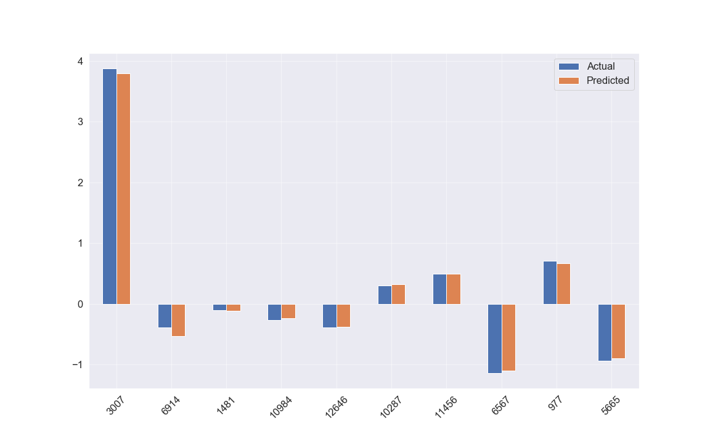{ width=100% height=100% }

From the values obtained (specifically, the RMSE), it seems that on both the non-regularized and regularized regressions, the values obtained are quite similar. The _RidgeCV_ algorithm also allows obtaining the best value of $λ$, which was 1.0235310218990269e-09, and being quite close to 0 indicates that this is just a Linear Regression (Ordinary Least Squares Regression).

<!-- The L2 norm term in ridge regression is weighted by the regularization parameter alpha. So, if the alpha value is 0, it means that it is just an Ordinary Least Squares Regression model. So, the larger is the alpha, the higher is the smoothness constraint. So, the smaller the value of alpha, the higher would be the magnitude of the coefficients.” -->

Nonetheless, it's important to visualize the Ridge coefficients as a function of the regularization as shown in Figure \ref{coef_reg}.

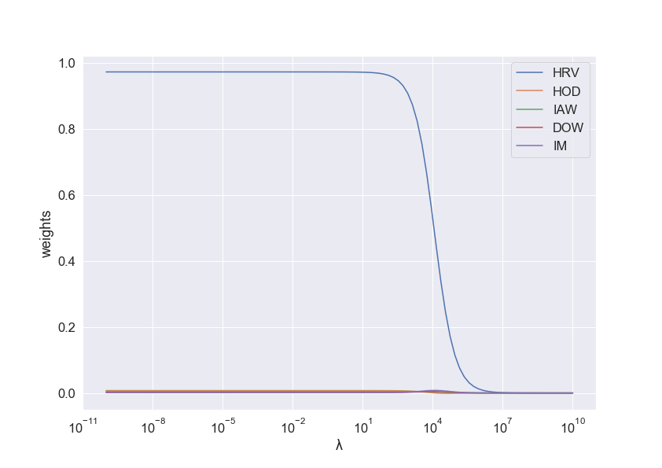{ width=100% height=100% }

There's a substantial difference between _t+1_ and the remaining attributes, thus explaining that the weights of _t+1_ are the ones who matter the most when it comes to a bias-variance trade-off. Considering the high score obtained previously, and knowing that a higher value of $λ$ indicates a lower variance and high bias, the optimal value of $λ$ should not be too large. A lower value of $λ$ seems to be appropriate, evidence suggested by the optimal value calculated already, after fitting the data to the _RidgeCV_ algorithm. 

The optimal regularization parameter $λ$ was then calculated by varying its values and its associated test error (using Root Mean Square Error). Figure \ref{reg_var_error} shows that the closer to 0 the regularization parameter is, the lower is the error. This is another indicator that this Ridge Regression is just a Linear Regression. The optimal value of the regularization parameter seems to be the lowest around `12`, considering that

$$
-log(λ) = -3
$$

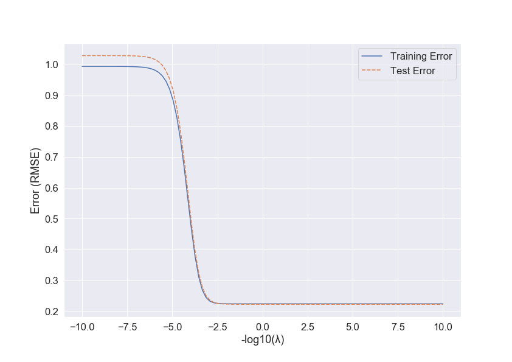{ width=100% height=100% }


### Effects of selected attributes when predicting the selected class

The effects of the selected attributes _HRV_, _HOD_, _IAW_, _DOW_, _IM_ when predicting the selected class _t+1_ are determined by the coefficients as part of the L2 regularization (achieved with $λ$). The determined coefficients when fitting the data to the Ridge algorithm, where:

```
[9.71570839e-01, 6.56130694e-03, 5.75053872e-03, 1.89328307e-03,4.45169066e-04]
```

The above values demonstrate that _HRV_, when compared to the remaining attributes, has the most effect when determining _t+1_. Specifically, it means that for every unit of _HRV_, there are 0.97 units of t+1 increasing. 

All in all, considering the data set, it makes sense that these values occur because its values are quite similar, i.e., _t+1_ is a feature extracted from HRV. For future purposes, it will be interesting to increase the lagging values so that it's possible to predict HRV values not only for the next hour but also for the next day (and/or week and so forth). 

It's important to mention that the remaining attributes are not as relevant. Thus, being at work or not, morning or not, does not have a relevant on HRV values.

## Regression - part B

### Comparison of three models

For the comparison, and due to the size of the data set, K1 = K2 = 5. The comparison of the three models is shown in Table \ref{model_comparison} (using Mean Absolute Error):

|   Outer fold |   Baseline error |   Linear Regression error | Linear Regression $λ$ |   ANN hidden units |   ANN error |
|-------------:|-----------------:|--------------------------:|----------------------:|-------------------:|------------:|
|            1 |        0.0499267 |                 0.0499653 |                 1e-10 |                  9 |    1.84182  |
|            2 |        0.0301518 |                 0.0303581 |                 1e-10 |                  8 |    1.78487  |
|            3 |        0.0318932 |                 0.0324046 |                 1e-10 |                  8 |    1.18325  |
|            4 |        0.0524825 |                 0.0523391 |                 1e-10 |                  8 |    0.946096 |
|            5 |        0.0857946 |                 0.085629  |                 1e-10 |                  8 |    1.54597  |

Table: two-level cross-validation to compare three models \label{model_comparison}

The baseline model - a linear regression without regularization parameters - has the lowest error where's the ANN has the highest. However, the baseline error and the regularized linear regression error are quite similar. The regularization parameters of the Linear Regression were very close to zero, thus closely matching the value obtained in the previous chapter.

### Statistical comparison

For the statistical comparison, a paired _t-test_ was used to compare the models, in terms of their generalization error. The _p-value_ was then calculated for the null hypothesis that the pair of models have the same performance. The confidence intervals were also calculated.

The results were the following are presented in Table \ref{statistical_comparison}

| models                                    |    p-value | confidence intervals                          |
|:------------------------------------------|-----------:|:----------------------------------------------|
| Baseline VS Regularized Linear Regression | 0.514396   | (-0.032617854919582835, 0.032438934843939164) |
| Baseline VS ANN                           | 0.00276655 | (-2.352198615043992, -0.9631828114922801)     |
| Regularized Linear Regression VS ANN      | 0.00276421 | (-2.352198615043992, -0.9631828114922801)     |

Table: Statistic comparison between models \label{statistical_comparison}

The high p-value on the first comparison shows that there is no statistical difference between models, because it indicates weak evidence against the null hypothesis, so it fails to reject the null hypothesis. However, the smaller p-value for the second and third comparisons on Table \ref{statistical_comparison} show that there's a strong evidence against the null hypothesis, thus rejecting it.  

## Classification

### Classification problem

The classification problem to be solve is a binary classification. The goal is to predict wether the subject is at work (_IAW_) based on the _HRV_ values. 

### Classification method

The chosen method for the classification problem was an Artificial Neural Network while variating the number of hidden units.

### Cross-validation

|   Outer fold |   Baseline error |   Log. Regression error     |   Log. Regression $λ$   |   ANN hidden units |   ANN error |
|-------------:|-----------------:|----------------------------:|------------------------:|-------------------:|------------:|
|            1 |         0.238806 |                    0.238806 |                      10 |                 10 |  120.256    |
|            2 |         0.238143 |                    0.238143 |                      10 |                  2 |    0.238143 |
|            3 |         0.236816 |                    0.236816 |                      10 |                  2 | 2121.4      |
|            4 |         0.238806 |                    0.238806 |                      10 |                  6 |  494.498    |
|            5 |         0.238885 |                    0.238885 |                      10 |                  1 | 1066.74     |

Table: Two-level cross-validation with hyper parameter testing

Both the baseline and the Logistic Regression algorithm have the same error, showing that the regularization parameter has no influence on the final error values. There is also a variation of the ANN error for the same hidden units, _h_. A possible explanation could be the small size of the test set.

### Statistical evaluation

The results from the statistical evaluation are shown in Table \ref{statistical_comparison_2}

| models              |    p-value | confidence interval                             |
|:--------------------|-----------:|:------------------------------------------------|
| Baseline VS Log Reg | nan        | (-0.0012800589867520478, 0.0012800589867520478) |
| Baseline VS ANN     |   0.111859 | (-841.3060461412431, 130.0951330735939)         |
| Log Reg VS ANN      |   0.111859 | (-841.3060461412431, 130.0951330735939)         |

Table: Statistic comparison between models \label{statistical_comparison_2}

Since the errors from the baseline model and the regularized logistic regression model are the same, then it's not possible to calculate the p-value. The confidence interval is also too wide due to this proximity of values. Also, the baseline and the regularized logistic regression models have the same p-value when comparing to the neural network.

In this case, considering the p-value is 0.111859 (and $\leq$ 0.05), the null hypothesis fails to be rejected thus meaning the lack of statistical difference between models. 

### Recommendations based on statistical evaluation

The baseline and the regularized logistic regression model are practically the same, meaning that the regularization does not affect the cost calculation. However, for 2 hidden units, the ANN has an error of 0.238143, albeit somewhat irregular because another fold with the same amount of hidden units presents a much higher error. 

Testing other different classification algorithms and comparing them in the same way as performed above is a recommendation, due to these results.

### Prediction using a logistic regression model and regularization parameter $λ$

A logistic regression model determines its output using the logistic sigmoid function, in order to return the probability of a certain binary value to occur. When compared to linear regression, where the values are continuous, the logistic regression predictions are discrete and, in this case, study, are binary.

The features between the regression and the classification are different already so it's not possible to compare them. Nonetheless, exploring other features - and especially the ones that don't revolve around HRV - might provide interesting results.


## Discussion 

### Lessons learned from regression and classification

A time-series data set has its peculiarities. For regression purposes, it's possible to conclude that the best use-case for these types of data sets are forecasting. To forecast properly, a few regularization methods were needed so that standardization and one-hot encoding of parameters where possible. By having so many different types of features, it's possible to understand the purpose of standardization. 

There are a few differences when assessing the performance of a regression model and classification one. In this project, the regression model (assessed via _mean squared error_ and _root mean square error_) allowed forecasting HRV values for the next hour with a very high level of accuracy. It was verified that the model turned out to be a Lest Squares Ordinary model because the remainder of features seem to not be relevant for the final score. An analysis of the influence of weights (via a Ridge regression) of the features allows concluding that only one feature had a significant impact when determining the regularization parameter. Despite being a bivariate data set, hyperparameter tuning takes a fundamental role in model optimization, i.e., achieving a good bias-variance trade-off. It was possible to understand that a proper interval of the $λ$ is quite important and a possible improvement in the hyperparameter tuning is to test different intervals and scales.

Another relevant measure of achieving a good trade-off, specifically for preventing overfitting, is cross-validation. A two-layer cross-validation results in a good way to overview ideal hyperparameters.

In terms of classification, other ways of performance assessment should've been performed, such as a confusion matrix, precision/recall or area under the ROC curve to analyze thoroughly and interpret True Positives and False Negatives. Moreover, fitting the data through other algorithms would be interesting. Nonetheless, having chosen an Artificial Neural Network allowed better understanding input, hidden and output layers. 

### Comparison with current literature

This data set is very personal, hence the existing literature is not contained to just one use case but instead, it contains aggregated data for several users. Thus, the results cannot be compared between this report and the existing literature. Moreover, literature refers to HRV as a mean of diagnosis of a specific, rather than classifying or predicting values. As a reminder, the feature to be predicted in the classification section is whether the author of this report was at work (_IAW_, binary), thus making the case study even more specific and without parallel published scientific articles.

Nonetheless, it's relevant to mention @chiew due to applying Machine Learning models for risk prediction of sepsis ($N=214$ patients). The models used where k-nearest neighbors, random forest, adaptive boosting, gradient boosting and support vector machine, which is different than the models used in the classification part of this project. The models were assessed using the area under the precision-recall curve, also different than the ones used previously.

Thus, it would be interesting to use the algorithms and performance assessment to classify HRV and its related features.

\pagebreak

# Part III - Unsupervised learning

## Clustering

For the clustering part of this report, a subset of the previously used data set was used. For this subset, two features were included: HRV and DOW. Table \ref{cluster_summary} shows a summary of this subset:

|       |   HRV (SDNN) |   Day of Week |
|:------|-------------:|--------------:|
| count |    932       |     932       |
| mean  |     41.2493  |       3.62983 |
| std   |     15.6852  |       1.83629 |
| min   |      8.21203 |       1       |
| 25%   |     30.8391  |       2       |
| 50%   |     38.8085  |       4       |
| 75%   |     49.5485  |       5       |
| max   |    173.526   |       7       |

Table: Summary of the subset \label{cluster_summary}

Also, a visualization for the subset is shown in Figure \ref{cluster_subset}

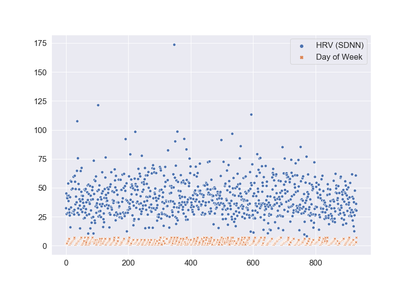{ width=100% height=100% }


### Hierarchical clustering

Within the two types of hierarchical clustering, for this report, the one used was the agglomerative hierarchical clustering. The affinity used was "Euclidean" and the linkage was "Ward". To determine the ideal number of clusters, a dendogram was built.

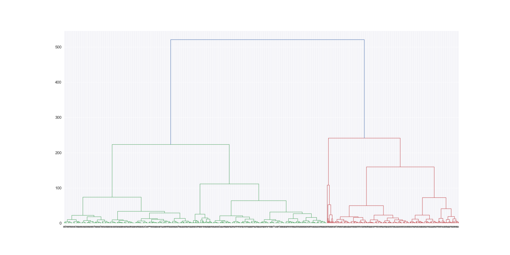{ width=100% height=100% }

From the Image \ref{cluster_dendogram} it's possible to verify that the ideal number of clusters is 3. Then it was possible to visualize the clusters, as shown in Image \ref{cluster_visualization}:

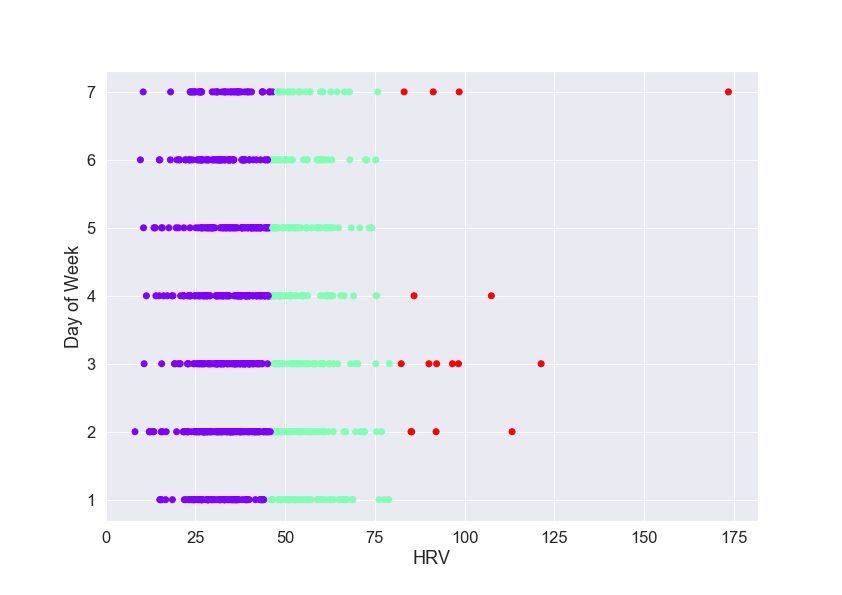{ width=100% height=100% }

As a reminder, the first (1) day of the week is Monday and the last (7) is Sunday. The clusters seems to be grouped according to its variability: with high variability, a new cluster is formed. The remainder of the clusters seem to be created around the average value of HRV (41.2493, as shown in Table \ref{cluster_summary} ), i.e., the purple cluster groups values below average and the green cluster groups values above average (excluding higher values). 

### Gaussian Mixture Model (GMM)

In order to estimate the number of components, a cross-validation was performed and the AIC (_Akaike Information Criterion_) and BIC (_Bayesian Information Criterion_) where determined, in order to execute the so-called elbow test. Figure \ref{gmm_elbow} shows the result:

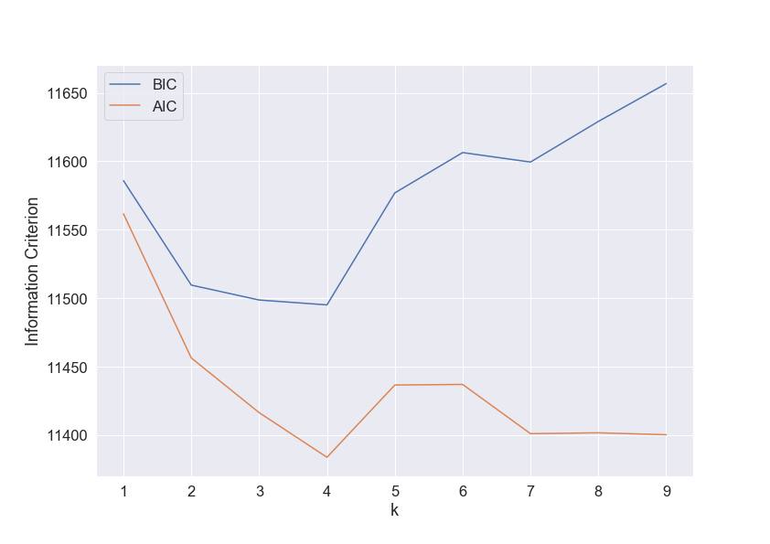{ width=100% height=100% }

Figure \ref{gmm_elbow} allows to conclude the ideal number of clusters is 2, where after that BIC starts increasing again. 

Now plotting the clusterized data, it's possible to see in Figure \ref{gmm_plot} that the clusters are split slightly over the mean value of HRV.

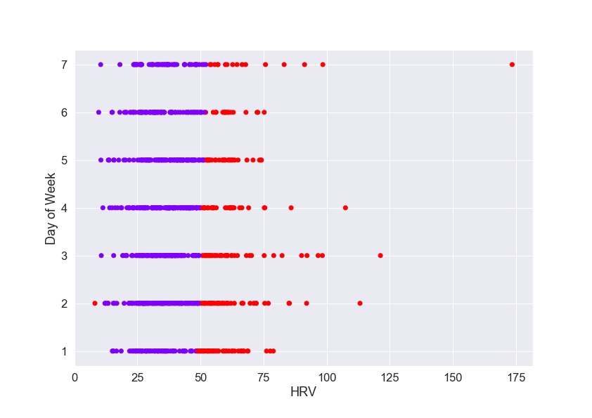{ width=100% height=100% }

### Quality of clustering

Both models can have underlying explanations that fit the generated clusters. The Hierarchical clustering model contains high values, thus showing a clear distinction between low, medium and high HRV values. The GMM and its 2 clusters are separating HRV values between its mean, which in practical terms also makes sense, i.e., when the values cross the 50-value of HRV it may mean that on those days (Friday, Saturday and Sunday) the general level of health is higher, whereas Monday corresponds to a lower level of health. 


## Anomaly/outlier detection

The premise that any instance that has a low affinity to all the clusters is likely to be an anomaly (@aurelien) is the foundation to determine outliers in this project. 

### Gaussian Kernel density

See Figure \ref{gknn_density}.

{ width=100% height=100% }

### KNN density 

See Figure \ref{knn_density}.

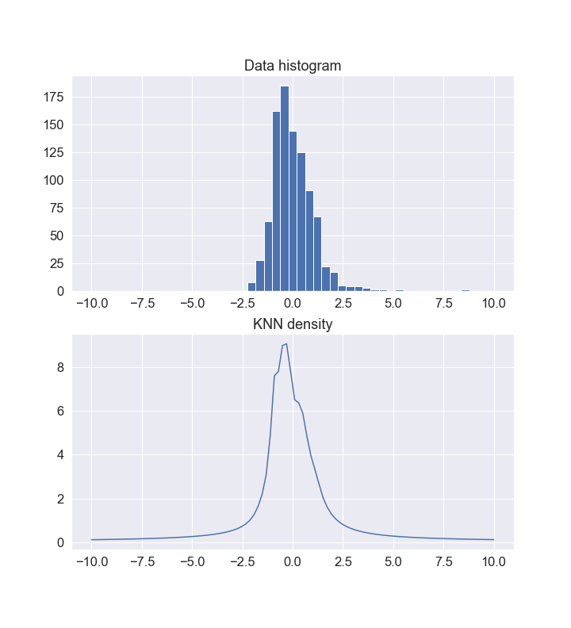{ width=100% height=100% }

### KNN average relative density

See Figure \ref{knn_ard}.

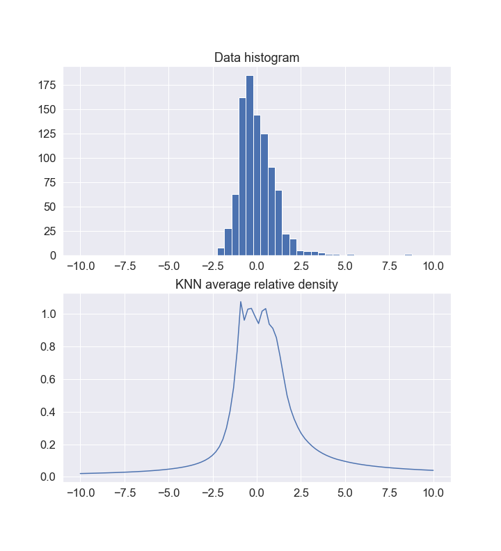{ width=100% height=100% }

### Outlier detection

According to the above figures, there are no outliers.

## Association mining

Due to the specific nature of this data set, a few considerations have to be taken into count:

- The main question to be answered - for this subchapter - is to determine when observations are made and if there are any associations with it. For example, is it possible to determine if an observation (a measurement of HRV) that has been made on a Saturday, will it also be made at 5 pm? Or is there any association between HRV values?
- The features _HOD_, _DOW_, and _HRV_ had to be binarized.

### Apriori algorithm

The Apriori algorithm was run with the following parameters:

- $minsupport = 0.005$
- $minconfidence = 0.020$
- $minlift = 2$

The confidence value is quite low in order to cover the fact that this is a very specific data set to be used for association mining. After the data sanitization as describe before, the results when running the Apriori algorithm are represented in Table \ref{association_mining_results}.

| associations                                     |   confidence |
|:-------------------------------------------------|-------------:|
| frozenset({'Day of Week__6', 'Hour of Day__11'}) |   0.00965665 |
| frozenset({'Day of Week__6', 'Hour of Day__23'}) |   0.00751073 |
| frozenset({'Hour of Day__17', 'Day of Week__7'}) |   0.0182403  |

Table: Association mining between measurements (observations) \label{association_mining_results}

Despite having a very low confidence level, it's possible to see that measurements made on a Saturday, where likely to be made at 11 am as well. For the same day of the week, it's also likely to have a measurement at 11 pm. Moreover, a measurement of HRV at 5 pm will likely be made on a Sunday.

The above values make sense in real terms due to the fact that the measurement devices (especially the Apple Watch) are more likely to be made during the weekend because the author uses it more often at those times.

\pagebreak

# References
